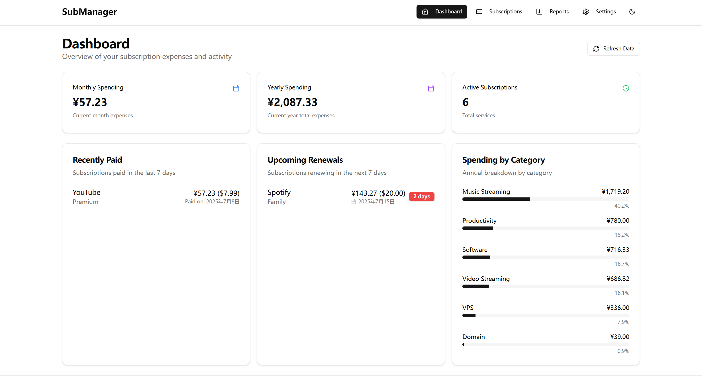
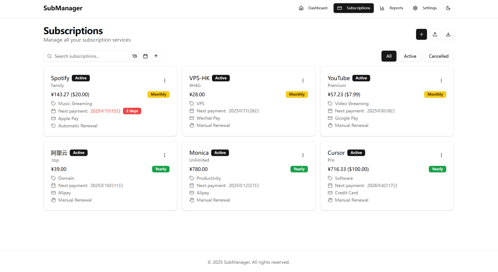
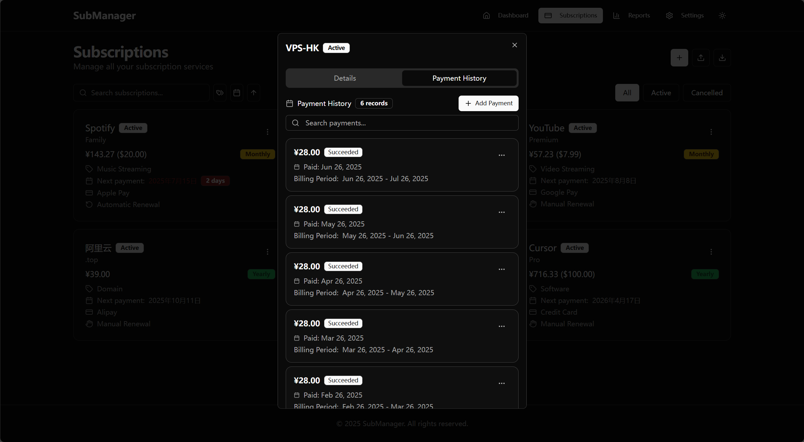
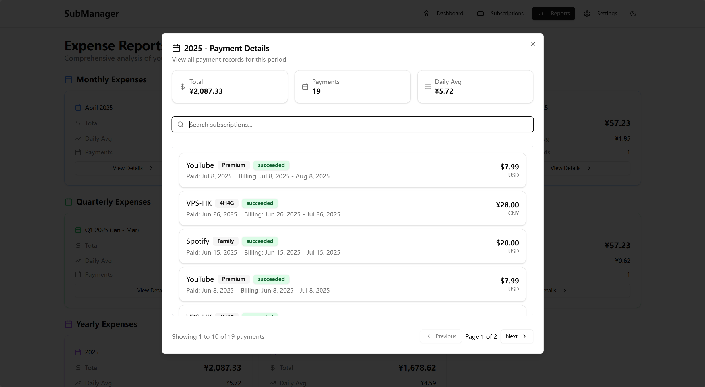
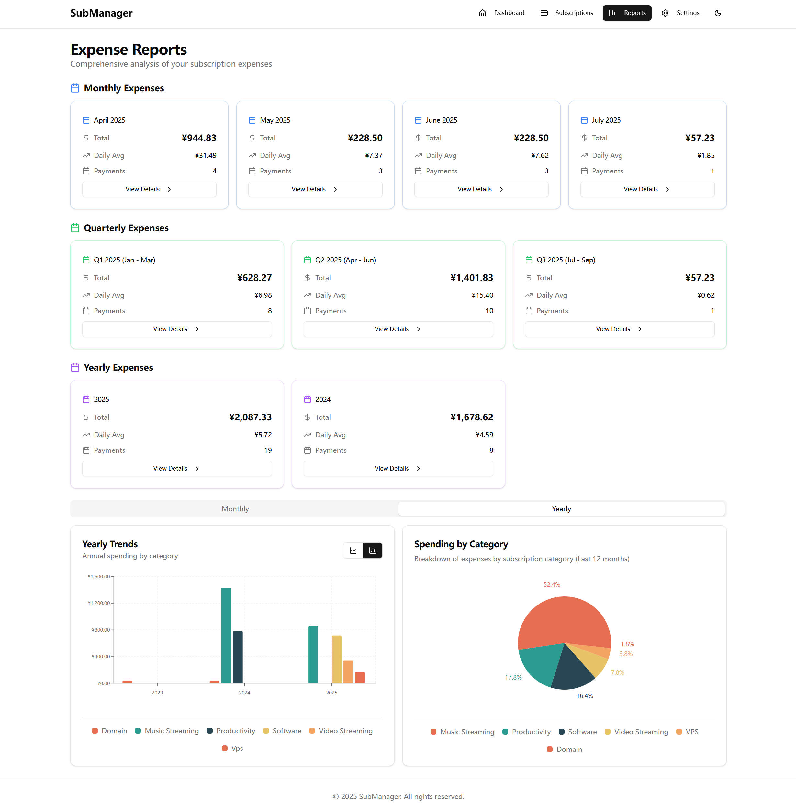
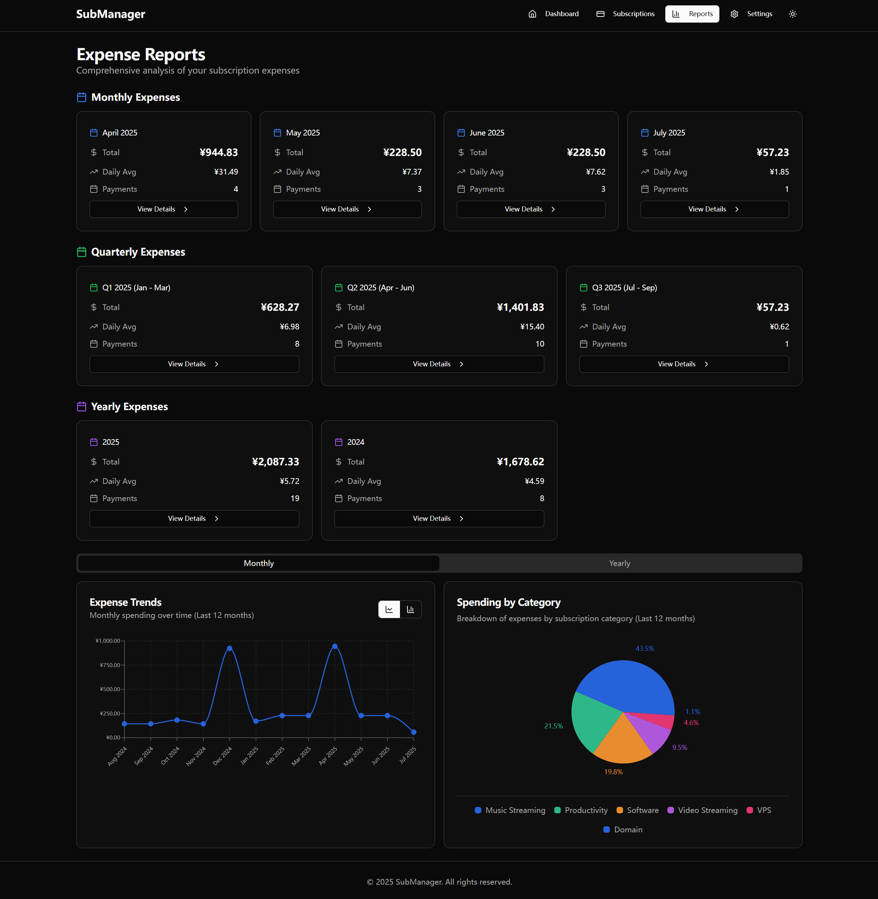

# 订阅管理系统 (Subscription Management System)

[English](README.md) | [简体中文](README.zh-CN.md)

一个现代化的订阅管理系统，帮助用户轻松管理和追踪各种订阅服务的费用和续费情况。

## 📸 界面预览

### 仪表板 - 智能费用概览

*智能仪表板展示月度/年度支出统计、即将到期的订阅提醒和分类费用分析*

### 订阅管理 - 完整服务管理

*完整的订阅生命周期管理，支持添加、编辑、状态管理和批量导入*

### 支付历史 - 详细记录追踪

*完整的支付历史记录，支持搜索，以及订单的增删改查*

### 月度费用 - 趋势分析

*月度支出订单，直观展示支出详情*

### 费用报告 - 深度数据分析

*强大的费用分析功能，包含趋势图表、分类统计和多维度数据展示*

### 深色主题 - 现代化界面

*支持深色主题*

## 🌟 项目特色

- **智能订阅管理** - 全面的订阅生命周期管理，支持自动/手动续费
- **多币种支持** - 支持7种主要货币，实时汇率自动更新
- **费用分析报告** - 强大的数据分析和可视化图表功能
- **响应式设计** - 完美适配桌面和移动端
- **本地优先** - 基于SQLite的本地数据存储，保护隐私
- **Docker部署** - 一键部署，开箱即用

## 📊 功能特性

### 核心功能
- ✅ **订阅管理** - 添加、编辑、删除订阅服务
- ✅ **智能仪表板** - 支出概览和即将到期提醒
- ✅ **分类统计** - 按类别、支付方式统计费用
- ✅ **搜索筛选** - 多维度搜索和状态筛选
- ✅ **自定义配置** - 自定义分类和支付方式

### 高级功能
- ✅ **自动续费处理** - 智能检测到期订阅并自动更新
- ✅ **多币种支持** - 7种主要货币实时转换 (USD, EUR, GBP, CAD, AUD, JPY, CNY)
- ✅ **汇率自动更新** - 集成天行数据API，每日更新汇率
- ✅ **费用报告仪表板** - 全面的费用分析和可视化
- ✅ **支付历史追踪** - 完整的支付记录和历史分析
- ✅ **数据导入导出** - CSV、Json格式数据导入导出
- ✅ **主题切换** - 支持浅色/深色/系统主题

## 🛠 技术栈

### 前端
- **框架**: React 18 + TypeScript
- **构建工具**: Vite
- **样式**: Tailwind CSS + shadcn/ui
- **状态管理**: Zustand
- **路由**: React Router
- **图表**: Recharts
- **UI组件**: Radix UI

### 后端
- **运行时**: Node.js
- **框架**: Express 5
- **数据库**: SQLite + better-sqlite3
- **定时任务**: node-cron
- **API认证**: API Key

### 部署
- **容器化**: Docker + Docker Compose
- **进程管理**: dumb-init
- **健康检查**: 内置健康检查端点

## 🚀 快速开始

### 环境要求
- Node.js 20+
- Docker & Docker Compose (推荐)

### Docker 部署 (推荐)

1. **克隆项目**
```bash
git clone <repository-url>
cd subscription-management
```

2. **配置环境变量**
```bash
cp .env.production.example .env
# 编辑 .env 文件，设置必要的配置
```

3. **启动服务**
```bash
docker-compose up -d
```

4. **访问应用**
- 前端界面: http://localhost:3001

### 本地开发

1. **安装依赖**
```bash
# 前端依赖
npm install

# 后端依赖
cd server
npm install
cd ..
```

2. **初始化数据库**
```bash
cd server
npm run db:init
cd ..
```

3. **启动开发服务**
```bash
# 启动后端 (终端1)
cd server
npm start

# 启动前端 (终端2)
npm run dev
```
前端界面: http://localhost:5173
后端服务: http://localhost:3001/api

## 🔧 配置说明

### 环境变量

创建 `.env` 文件并配置以下变量：

```bash
# API安全密钥 (必需)
API_KEY=your_secret_api_key_here

# 服务端口 (可选，默认3001)
PORT=3001

# 基础货币 (可选，默认CNY)
BASE_CURRENCY=CNY

# 天行数据API密钥 (可选，用于汇率更新)
TIANAPI_KEY=your_tianapi_key_here

# 数据库路径 (Docker部署时使用)
DATABASE_PATH=/app/data/database.sqlite
```

### 数据库管理

```bash
# 初始化数据库
npm run db:init

# 运行迁移
npm run db:migrate

# 重置数据库
npm run db:reset
```

## 🤝 贡献指南

1. Fork 项目
2. 创建功能分支 (`git checkout -b feature/AmazingFeature`)
3. 提交更改 (`git commit -m 'Add some AmazingFeature'`)
4. 推送到分支 (`git push origin feature/AmazingFeature`)
5. 开启 Pull Request

## 📄 许可证

本项目采用 MIT 许可证 - 查看 [LICENSE](LICENSE) 文件了解详情
